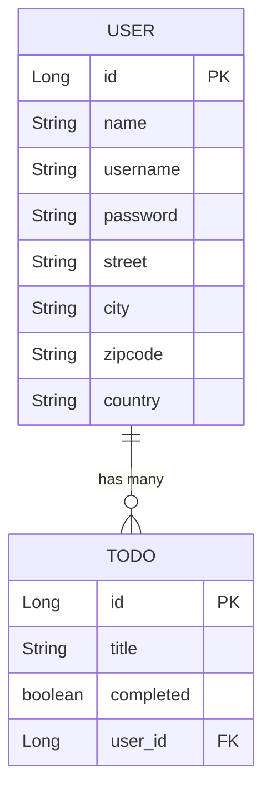

# Prueba Técnica - Sistema de Gestión de TODOs

Una aplicación Spring Boot para gestionar listados de tareas de usuarios con autenticación JWT y interfaz web.

## 📋 Tabla de Contenidos
- [Requisitos del Sistema](#requisitos-del-sistema)
- [Configuración y Instalación](#configuración-y-instalación)
- [Ejecución de la Aplicación](#ejecución-de-la-aplicación)
- [Configuración de Base de Datos](#configuración-de-base-de-datos)
- [Estructura del Proyecto](#estructura-del-proyecto)
- [Diagrama de Modelos](#diagrama-de-modelos)
- [Documentación de la API](#documentación-de-la-api)
- [Tecnologías Utilizadas](#tecnologías-utilizadas)

## 🔧 Requisitos del Sistema

- **Java 24** o superior
- **Maven 3.8+**
- **MySQL**
- **Git**

## ⚙️ Configuración y Instalación

### 1. Clonar el repositorio
```bash
git clone https://github.com/Naimche/pruebatecnica.git
cd pruebatecnica
```

### 2. Configuración de la Base de Datos MySQL

1. **Crear la base de datos:**
```sql
CREATE DATABASE todo;
```

2. **Configurar credenciales de acceso:**
   - Editar `src/main/resources/application.properties`
   - Modificar las siguientes propiedades según tu configuración:
```properties
spring.datasource.url=jdbc:mysql://localhost:3306/todo
spring.datasource.username=tu_usuario
spring.datasource.password=tu_contraseña
```

### 3. Instalar dependencias
```bash
mvn clean install
```

## 🚀 Ejecución de la Aplicación

### Opción 1: Usando Maven
```bash
mvn spring-boot:run
```

### Opción 2: Usando el JAR compilado
```bash
mvn clean package
java -jar target/pruebatecnica-0.0.1-SNAPSHOT.jar
```

### Opción 3: Usando Maven Wrapper (Windows)
```bash
./mvnw.cmd spring-boot:run
```

La aplicación estará disponible en: `http://localhost:8080`


## 📝 Información adicional

Para facilitar la prueba técnica, he establecido datos iniciales que se cargan automáticamente.

> **Nota:** Estos datos pueden deshabilitarse configurando las siguientes propiedades en `application-dev.properties`:

```properties
spring.jpa.defer-datasource-initialization=true -> false
spring.sql.init.mode=always -> never
```
### Credenciales de acceso

- **Usuario:** el que se muestra en la tabla de datos iniciales.
- **Contraseña:** `12345678!`
---
## 🗄️ Configuración de Base de Datos

### Profiles Disponibles
- **dev**: Perfil de desarrollo (activo por defecto)


### Configuración de Desarrollo (`application-dev.properties`)
```properties
bypass.password = false
security.httpsEnabled = false
security.jwt.expiration-time=3600000
max.title.length=100
max.username.length=50
```

### Configuración Principal (`application.properties`)
```properties
spring.application.name=pruebatecnica
spring.profiles.active=dev

# Database Configuration
spring.datasource.url=jdbc:mysql://localhost:3306/todo
spring.datasource.driver-class-name=com.mysql.cj.jdbc.Driver

spring.jpa.hibernate.ddl-auto=update
spring.jpa.show-sql=true
spring.jpa.database-platform=org.hibernate.dialect.MySQL8Dialect

# Thymeleaf Configuration
spring.thymeleaf.cache=false
spring.thymeleaf.prefix=classpath:/templates/
spring.thymeleaf.suffix=.html
```

## 📁 Estructura del Proyecto

```
src/
├── main/
│   ├── java/com/naimche/pruebatecnica/
│   │   ├── PruebatecnicaApplication.java
│   │   ├── config/
│   │   │   └── SecurityConfig.java
│   │   ├── controller/
│   │   │   ├── AuthController.java
│   │   │   ├── TodoController.java
│   │   │   ├── UserController.java
│   │   │   └── web/
│   │   │       └── TodoViewController.java
│   │   ├── dto/
│   │   │   ├── AuthRequestDto.java
│   │   │   ├── CreateUserDto.java
│   │   │   ├── ErrorResponseDto.java
│   │   │   ├── TodoDto.java
│   │   │   └── UserDto.java
│   │   ├── entity/
│   │   │   ├── Address.java
│   │   │   ├── Todo.java
│   │   │   └── User.java
│   │   ├── exception/
│   │   ├── filter/
│   │   ├── mapper/
│   │   ├── repository/
│   │   └── service/
│   └── resources/
│       ├── application.properties
│       ├── application-dev.properties
│       └── templates/
└── test/
    ├── java/com/naimche/pruebatecnica/
    │   ├── controller/
    │   ├── service/
    │   │   ├── AuthServiceTest.java
    │   │   └── TodoServiceTest.java
    │   └── PruebatecnicaApplicationTests.java
    
```

---

## 🗃️ Diagrama de Modelos

### Entidades Principales



### Descripción de Entidades

#### 🧑 Usuario (User)
| Campo | Tipo | Descripción |
|-------|------|-------------|
| id | Long | Identificador único (PK) |
| name | String | Nombre completo del usuario |
| username | String | Nombre de usuario único |
| password | String | Contraseña encriptada |
| address | Address | Información de dirección (Embeddable) |

#### 📝 Tarea (Todo)
| Campo | Tipo | Descripción |
|-------|------|-------------|
| id | Long | Identificador único (PK) |
| title | String | Título de la tarea (máx. 200 caracteres) |
| completed | boolean | Estado de completitud |
| user | User | Usuario propietario (FK) |

#### 🏠 Dirección (Address) - Embeddable
| Campo | Tipo | Descripción |
|-------|------|-------------|
| street | String | Dirección/Calle |
| city | String | Ciudad |
| zipcode | String | Código postal |
| country | String | País |

---

## 📖 Documentación de la API

### Base URL
```
http://localhost:8080/api
```

### 🔐 Autenticación

#### Registrar Usuario
- **Endpoint:** `POST /api/auth/register`
- **Descripción:** Registra un nuevo usuario en el sistema
- **Content-Type:** `application/json`

**Request Body:**
```json
{
   "name": "Naim",
   "username": "naimche",
   "password": "Amig12123123123!",
   "address": {
      "street": "123 Main St",
      "city": "Anytown",
      "zipcode": "12345",
      "country": "CountryName"
   }
}
```

**Response:**
```json
{
   "id": 1,
   "name": "Naim",
   "username": "naimche",
   "address": {
      "street": "123 Main St",
      "city": "Anytown",
      "zipcode": "12345",
      "country": "CountryName"
   }
}
```


#### Iniciar Sesion 
- **Endpoint:** `POST /api/auth/login`
- **Descripción:** inicio de sesion de un usuario existente en el sistema
- **Content-Type:** `application/json`

**Request Body:**
```json
{
    "username": "naimche",
    "password": "Amig12123123123!"
}
```
**Response:** `200 OK` si es exitoso, `403 Forbidden` si las credenciales son invalidas.

### 👥 Usuarios

#### Obtener Todos los Usuarios
- **Endpoint:** `GET /api/users`
- **Descripción:** Obtiene la lista de todos los usuarios registrados

**Response:**
```json
[
   {
      "id": 1,
      "name": "Naim",
      "username": "naimche",
      "address": {
         "street": "123 Main St",
         "city": "Anytown",
         "zipcode": "12345",
         "country": "CountryName"
      }
   }
]
```

### 📋 TODOs

#### Crear TODO
- **Endpoint:** `POST /api/todos`
- **Descripción:** Crea una nueva tarea

**Request Body:**
```json
{
   "title": "Hacer la comida",
   "completed": false,
   "userId": 1
}
```

**Response:**
```json
{
   "id": 1,
   "title": "Hacer la comida",
   "completed": false,
   "userId": 1,
   "username": "naimche",
   "country": "CountryName"
}
```

#### Obtener TODOs (con paginación y filtros)
- **Endpoint:** `GET /api/todos`
- **Descripción:** Obtiene la lista de tareas con soporte para paginación, ordenamiento y filtros

**Parámetros de consulta:**

| Parámetro         | Tipo   | Valor por defecto | Descripción                                                               |
| ----------------- | ------ | ----------------- | ------------------------------------------------------------------------- |
| **page**          | int    | 0                 | Número de página (basado en 0).                                           |
| **size**          | int    | 10                | Cantidad de elementos por página.                                         |
| **sortBy**        | String | `"id"`            | Campo por el que se ordenan los datos.                                    |
| **sortDirection** | String | `"asc"`           | Dirección de ordenamiento: `"asc"` (ascendente) o `"desc"` (descendente). |
| **title**         | String | *(opcional)*      | Filtro por título.                                                        |
| **username**      | String | *(opcional)*      | Filtro por nombre de usuario.                                             |

**Ejemplo de request:**
```
GET /api/todos?page=0&size=5&sortBy=title&sortDirection=desc&title=comprar&username=juan
```

**Response:**
```json
{
  "content": [
    {
      "id": 1,
      "title": "Comprar leche",
      "completed": false,
      "userId": 1,
      "username": "juanperez",
      "country": "España"
    }
  ],
  "pageable": {
    "sort": {
      "sorted": true,
      "unsorted": false
    },
    "pageNumber": 0,
    "pageSize": 5
  },
  "totalElements": 1,
  "totalPages": 1,
  "first": true,
  "last": true
}
```


#### Obtener TODO por ID
- **Endpoint:** `GET /api/todos/id/{id}`
- **Descripción:** Obtiene una tarea específica por su ID

**Response:**
```json
{
   "id": 1,
   "title": "Hacer la comida",
   "completed": false,
   "userId": 1,
   "username": "naimche",
   "country": "CountryName"
}
```

#### Actualizar TODO
- **Endpoint:** `PATCH /api/todos/update/{id}`
- **Descripción:** Actualiza una tarea existente

**Request Body:**
```json
{

   "title": "Ira a correr",
   "completed": true,
   "userId": 1
}
```

**Response:**
```json
{
   "id": 1,
   "title": "Ira a correr",
   "completed": true,
   "userId": 1,
   "username": "naimche",
   "country": "CountryName"
}
```

#### Eliminar TODO
- **Endpoint:** `DELETE /api/todos/delete/{id}`
- **Descripción:** Elimina una tarea específica
- **Response:** `204 No Content` si es exitoso, `404 Not Found` si no existe

### 🌐 Interfaz Web

#### Páginas Disponibles
- **Login:** `GET /login`
- **Lista de TODOs:** `GET /todos`
- **Crear/Editar TODO:** `GET /todos/create[?id={todoId}]`

### 📊 Códigos de Respuesta HTTP

| Código | Descripción |
|--------|-------------|
| 200 | OK - Operación exitosa |
| 201 | Created - Recurso creado exitosamente |
| 204 | No Content - Eliminación exitosa |
| 400 | Bad Request - Datos de entrada inválidos |
| 404 | Not Found - Recurso no encontrado |
| 500 | Internal Server Error - Error interno del servidor |

### 🔒 Manejo de Errores

**Formato de respuesta de error:**
```json
{
  "code": "TODO_NOT_FOUND",
  "message": "Todo not found"
}
```

**Códigos de error personalizados:**
- `USER_NOT_FOUND`: Usuario no encontrado
- `TODO_NOT_FOUND`: Tarea no encontrada
- `USER_NAME_ALREADY_EXISTS` : Nombre de usuario ya existe
- `WEAK_PASSWORD` : Contraseña débil
- `NOT_AUTHORIZED` : No autorizado

## 🛠️ Tecnologías Utilizadas

- **Framework:** Spring Boot 3.5.3
- **Java:** Version 24
- **Base de Datos:** MySQL 8.0
- **ORM:** Spring Data JPA / Hibernate
- **Seguridad:** Spring Security + JWT
- **Frontend:** Thymeleaf
- **Mapeo:** MapStruct
- **Build Tool:** Maven
- **Testing:** JUnit 5, Mockito

## 📄 Licencia

Este proyecto de demostración en **Java - Spring** fue desarrollado íntegramente por **Naim Cheddi Elkhattabi**, exclusivamente con fines educativos y de evaluación técnica.
